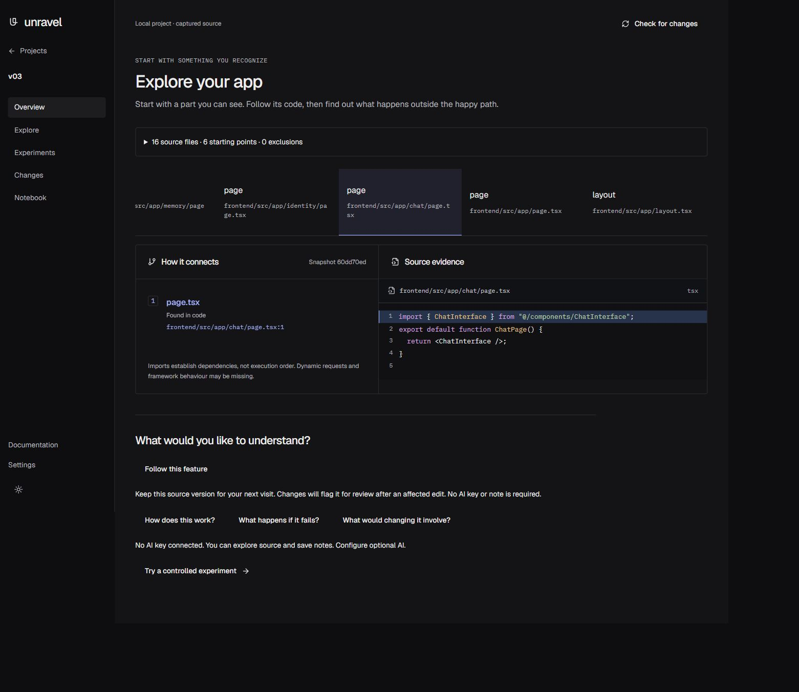
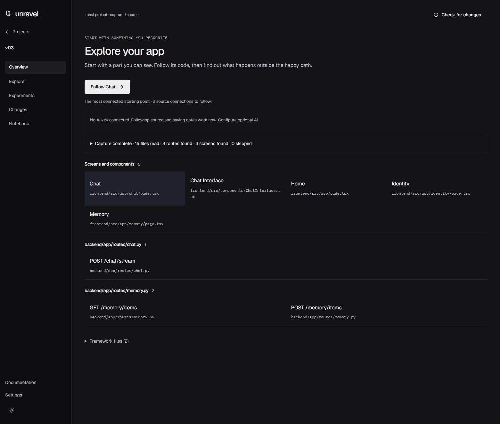
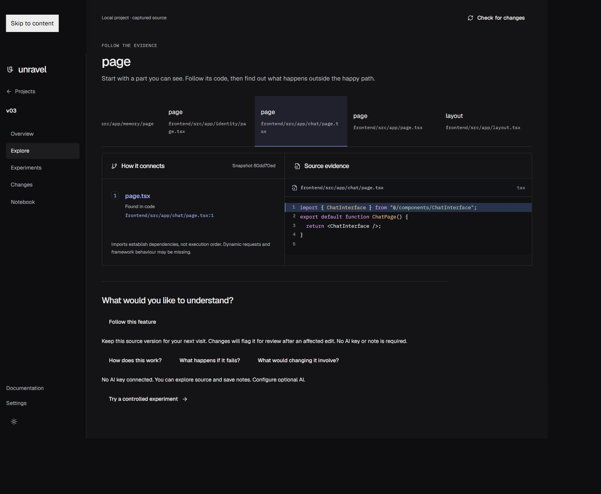
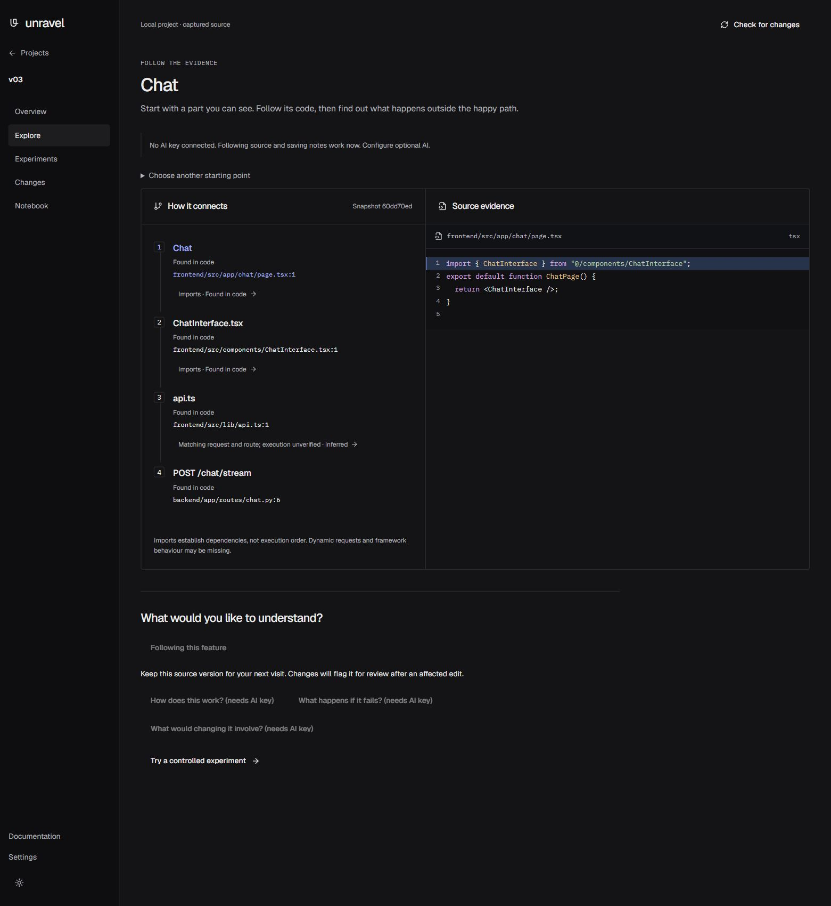

# v0.3 verification — real feature maps

Base: `7db70f1`. Verified on Windows with a fresh Python 3.14 virtual environment on 10 October 2026. The landing page was not edited. No AI provider was called during verification.

## Automated checks

| Check | Result |
| --- | --- |
| `python -m pytest -q` (fresh environment, including template-link follow-up) | 91 passed |
| `cd byline && npm run typecheck` | Passed |
| `cd byline && npm test` | 6 passed, 3 test files |
| `cd byline && npm run build` | Passed, including 13 prerendered public pages |
| `git diff --check` | Passed |

The fresh environment was created with `python -m venv .local/v03-venv`, then installed using `python -m pip install -e ".[dev,browser]"`. It resolved tree-sitter 0.25.2, Python grammar 0.25.0, JavaScript grammar 0.25.0 and TypeScript grammar 0.23.2. `ravel doctor` reported a ready parser for Python, TSX and JavaScript. Each grammar is exercised by a separate subprocess regression; another test verifies the doctor message for a native crash exit code.

Windows sandbox restrictions initially prevented temporary-fixture creation and Vite realpath access. Verification ran outside that restriction. Pytest temporary files were placed outside the Git-ignored `.local` directory so source capture did not discard the fixtures. No product code was changed to accommodate those restrictions.

## Manual fixture verification

The same fixture in `apps/ravel/tests/fixtures/v03` was connected through the browser to both the baseline (`7db70f1`) and the changed app. The baseline used its own archived source and production assets. The changed app was started with the fresh environment's `ravel serve` command and separate local storage. It stayed running during capture and subsequent source exploration.

- The completed capture reports 16 files read, 3 routes found, 4 Next.js screens found, and no skipped fixture files. Components remain available as additional starting points. Generated/dependency folders and individual skipped-file reasons are included in capture details when present.
- Overview shows Chat, Memory, Identity and Home. Layout and app startup are collapsed under Framework files. Startup is labelled `App startup (main.py)`.
- `Follow Chat` works with no AI key. The three AI question chips are disabled and labelled `(needs AI key)`; one small banner explains optional AI.
- Explore shows `chat/page.tsx → ChatInterface.tsx → api.ts`. The literal request also links to `POST /chat/stream` as an inferred connection, with execution explicitly unverified.
- The backend feature is `POST /chat/stream`, including its `include_router` prefix. It reaches `services/chat.py → services/store.py`.
- Both `GET /memory/items` and `POST /memory/items` are present from a multiline `api_route` decorator and the router's `/memory` prefix.
- Existing captures are reanalysed on Check for changes when their analysis version is old, even if source content is unchanged. The regression verifies that a subsequent refresh reuses the upgraded snapshot.
- Experiments has app, browser and recipe status steps. An unreachable local URL hides the recipe editor and approval form. Starting the disposable reference app changes app status to Ready and reveals setup. Connected-project copy does not call the project a simulation.

Unit regressions also cover 15 routes without truncation, nested registration prefixes, imported router aliases, package-local JSONC configs, inherited configs, baseUrl, index files, Python absolute imports and cycles/node caps. Maps are bounded to two import hops and 12 total visible nodes; imports establish dependencies, not execution order.

## Additional real-project check

The local Miryn production checkout was analysed read-only. It yielded 46 routes. The actual frontend Chat page (outside its additional visual-review copy) reaches ChatInterface and the API client, and `POST /chat/stream` reaches backend services. Chat, Memory, Identity and Home are identified from the Next.js routes. This checkout contains extra source copies, so its file count differs from the 246-file dogfood capture. No Miryn files were modified or sent to an AI provider.

## Screenshots

The desktop comparisons use matching viewport settings and the same fixture. Mobile layouts were also checked with a 390-pixel viewport override. Screenshots contain only disposable fixture source.

| View | Before | After |
| --- | --- | --- |
| Overview |  |  |
| Explore |  |  |

Additional captures show the backend map, mobile views and the unreachable-app state in `v03-screenshots/`.

## Limits

Dynamic imports, computed router prefixes and framework execution remain partial static evidence. Browser experiment execution was not attempted: the fresh environment has the browser extra, but Chromium is not installed. The checklist reports that missing binary instead of claiming browser readiness. The prepared Search demo retains its simulation label.

## Template-link follow-up

The dependency is now pinned exactly to `tree-sitter==0.25.2`, and doctor recommends that same version. Template requests with a declared constant base and a complete literal suffix, such as ``fetch(`${API_URL}/chat/stream`)``, now supply the suffix path for exact route matching. Dynamic endpoint/path interpolations remain excluded. The base's runtime origin is not evaluated; the cross-stack edge stays inferred and execution remains unverified.

Request discovery happens before the visible-node cap, so a broad screen cannot crowd out its API client. A shared client prioritizes the route whose path matches the feature name; that route's two-hop source dependencies share the 12-node map budget. Different routes in the same backend file do not create extra links to the selected route label.

The actual Miryn folder was connected in the browser after this change: 247 files read and 46 routes found. Explore visibly joins `Chat → ChatInterface.tsx → api.ts → POST /chat/stream` and shows `services/importance.py` and `services/fact_store.py` downstream of `backend/app/api/chat.py`. A local screenshot records this check without adding Miryn source to this public repository. All 91 Python tests, six frontend tests, typecheck and the production build passed for the follow-up.
